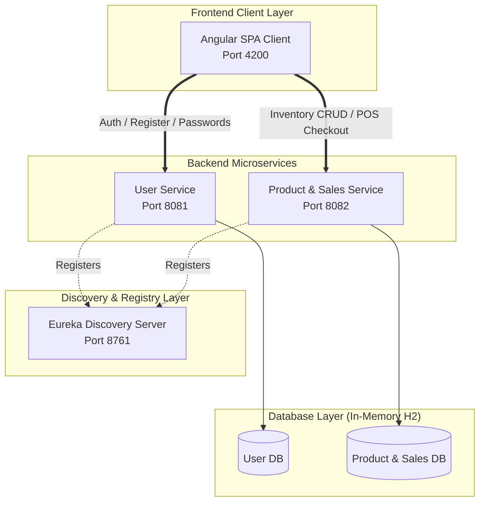

# 🏪 Shop Management System: Architecture & Functional Guide

Welcome to the architectural blueprint and functionality guide for the **Shop Management System**. This system is engineered as a modern, distributed microservice application with a premium, responsive Angular frontend.

---

## 🗺️ System Architecture

The project consists of three Spring Boot backend microservices and a single Angular frontend, communicating in a decoupled, discovery-driven environment.



---

## ⚙️ Core Service Breakdown

### 1. 📡 Eureka Discovery Server (`eureka-server` - Port `8761`)
Acts as the central directory for all microservices. 
* **Self-Registration:** When `user-service` and `product-service` start up, they automatically register their network locations (IP and Port) with Eureka.
* **Health Checks:** Eureka polls active instances periodically to verify heartbeats.

### 2. 🔐 User Authentication Service (`user-service` - Port `8081`)
Manages security, users, roles, and credentials.
* **Technology Stack:** Spring Boot, Spring Data JPA, H2 Database, Lombok.
* **Primary Features:**
  * User Registration with unique username checks.
  * User Authentication (Login) validating stored passwords.
  * Secured password modification endpoint (`PUT /api/users/change-password`).
* **Database Schema:** `users` table:
  | Column Name | Data Type | Description |
  | :--- | :--- | :--- |
  | `id` | `Long (Primary Key)` | Auto-incremented identifier |
  | `name` | `String (Unique)` | Alphanumeric username |
  | `password` | `String` | Account passcode |
  | `contact` | `String` | 10-digit mobile number |

### 3. 📦 Product & Sales Service (`product-service` - Port `8082`)
Manages inventory, point-of-sale checkouts, and transaction records.
* **Technology Stack:** Spring Boot, Spring Data JPA, H2 Database, Lombok.
* **Primary Features:**
  * Inventory management (Full CRUD: Add, Read, Update, Delete products).
  * POS checkout decrementing stock levels.
  * Transaction logging for sales history reporting.
* **Database Schemas:**
  * `products` table:
    | Column Name | Data Type | Description |
    | :--- | :--- | :--- |
    | `id` | `Long (PK)` | Auto-incremented identifier |
    | `name` | `String` | Product label |
    | `price` | `Double` | Unit cost |
    | `quantity` | `Integer` | Current stock count |
  * `sales_records` table:
    | Column Name | Data Type | Description |
    | :--- | :--- | :--- |
    | `id` | `Long (PK)` | Auto-incremented identifier |
    | `product_name`| `String` | Copied product label for history preservation |
    | `quantity` | `Integer` | Units checked out |
    | `total_price` | `Double` | Grand total (`price * quantity`) |
    | `sale_date` | `Timestamp` | Instant of transaction |

### 4. 💻 Angular SPA Client (`shop-frontend` - Port `4200`)
A premium user portal showcasing Outfit typography, glassmorphism aesthetics, fluid gradient background blobs, and reactive elements.
* **State Management:** Angular Signals (`signal`, `computed`) for blazing-fast state tracking.
* **Primary Views:**
  1. **Login/Register:** Custom validator overlays, real-time input sanity warnings, show/hide password buttons, and a password strength meter.
  2. **Dashboard:** KPI summary cards (Total Revenue, Inventory count, Active Users) and a live sales transaction log table.
  3. **Inventory Management:** Product catalog editing, item additions, and deletions with responsive modals.
  4. **POS sales terminal:** Interactive shopping cart adding/removing catalog items and deducting inventory in real-time.

---

## 🔄 Dynamic Flows & Operations

> [!NOTE]
> All backend database interactions are fully transactional. For instance, in POS checkouts, inventory deduction and sales logging execute inside a single transaction to guarantee data integrity.

### A. User Registration & Sign In Flow
```
[User Input] 
    │ (Real-time checks: username length, password strength, contact digits)
    ▼
[Angular Form Validated] ──(HTTP POST)──► [User Service]
                                             │
                                             ▼
                                     [Checks DB for name]
                                     ├── (Exists) ──► 409 Conflict
                                     └── (New)    ──► Save to DB & Return User (201)
```

### B. Point of Sale Checkout Flow
```
[Select items in POS] ──► [Click Checkout] ──► [HTTP POST to Product Service]
                                                       │
                                                       ▼
                                            [Locks database record]
                                            [Validates Quantity Available]
                                            ├── (Insufficent) ─► 400 Bad Request
                                            └── (Sufficient)  ─► Deduct Stock 
                                                                 Log Sales Record
                                                                 Save & Return 200 OK
```

### C. Admin Password Modification Flow
```
[Click Clickable Name/Cog] ──► [Enter Password] ──(HTTP PUT)──► [User Service]
                                                                     │
                                                                     ▼
                                                              [Updates Record]
                                                              [Returns 200 OK]
```

---

## 💎 Extraordinary Features & Visual Details

* **Glassmorphism Panels:** Translucent cards (`backdrop-filter: blur(16px); background: rgba(255,255,255,0.03);`) provide a floating, layered look.
* **Animated Neon Blobs:** 3 high-performance SVG/CSS blobs slide and scale continuously behind the login card, adding rich depth.
* **Password Strength Algorithm:** Real-time computation checking complexity (uppercase letters, numbers, length) to guide users reactively.
* **Robust Error Handling:** Intercepts REST validation issues and displays readable warnings (preventing generic JSON errors).
